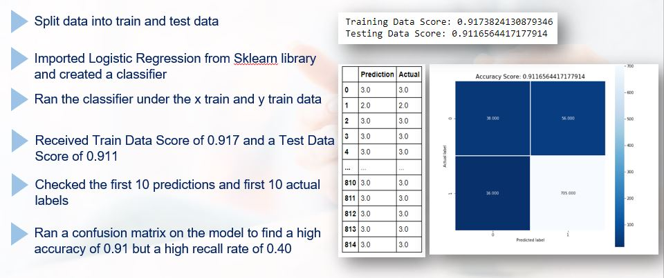

# Diabetes Data Analysis & Machine Learning Prediction

# Project Background

Welcome to team META-B's Diabetes Data Analysis& ML Prediction Project! 

Our members include: Emily Shevell, Maury Agami, Angela Sivirichi, Braden Wang and Tajudeen Adeyemi 

In this project, we try to gain gain an in-depth understanding of diabetes by using Data Analysis & Machine Learning.

# Contents

* Data Exploration by Tableau
* Machine Learing Modelling: Logistic Regression, Deep Learning, SVM
* Front-end Website Deployment

# Datasets

* Open Data Project with NHANES 2011-2012 Data. Link: https://data.world/rhoyt/librehealth-educational-ehr

# Some Screenshots from Project

